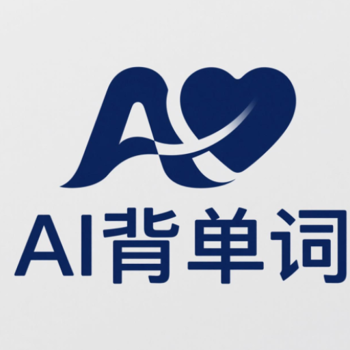
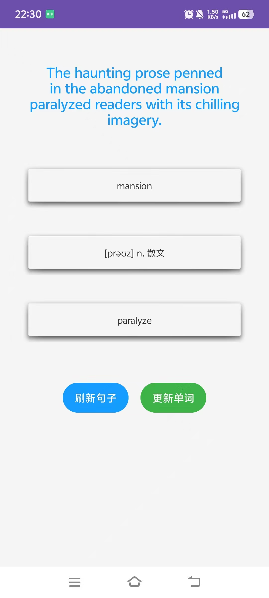
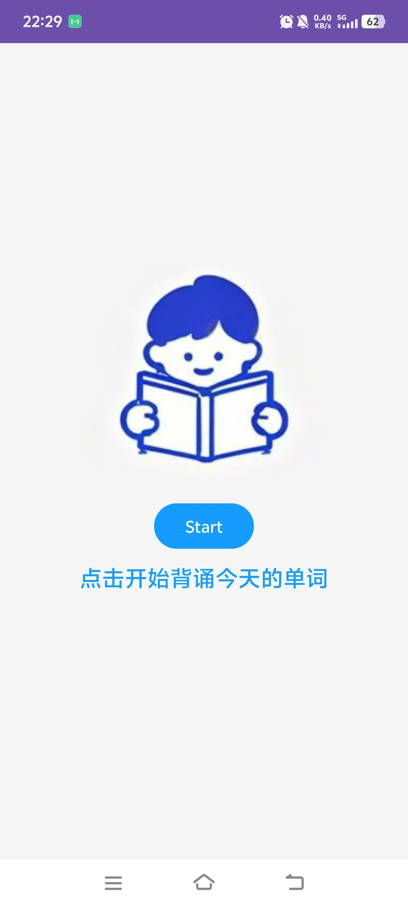
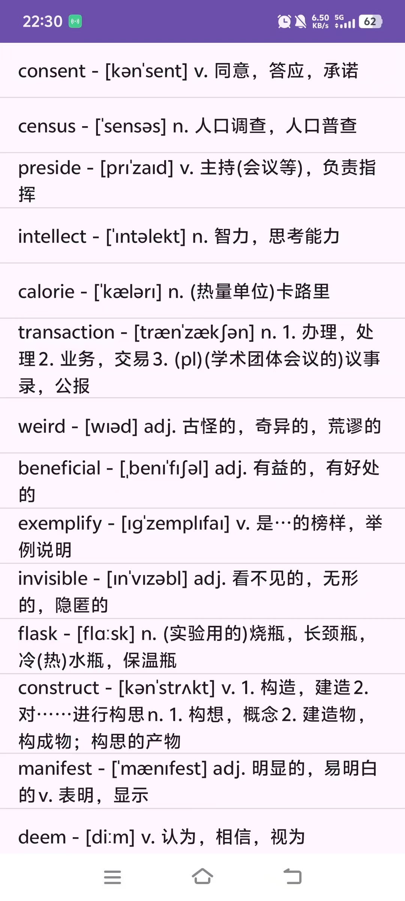

# WordApp 开发文档

## 项目概述

“AI背单词”App 是一个面向英语学习的移动应用，旨在帮助用户通过每日句子和单词学习提升词汇量和语言理解能力。基于 Android 平台开发，并依赖后端服务器提供数据支持。应用使用 HTTP 协议进行数据交互。核心功能包括：

1. **开局界面**：展示欢迎信息和启动按钮，引导用户进入学习模式。
2. **主界面**：显示每日句子和三个单词，支持点击翻译、刷新新句子，并通过右滑切换到存储单词界面。
3. **存储单词界面**：展示用户学习过的单词及其翻译，按时间排序。
4. **数据库支持**：本地 SQLite 数据库存储学习记录，后端 MySQL 数据库提供每日数据。
   
## 开发流程

### 1. 需求分析

- **功能需求**：
  - 开局界面：包含进度条、开始按钮和提示文本“点击开始背诵今天的单词”。
 
  - 主界面：显示句子和三个单词，点击显示翻译，底部刷新按钮支持加载新内容，刷新时显示进度条，句子保持不变。
  - 存储单词界面：通过右滑进入，展示历史学习记录。
  - 数据交互：通过 HTTP 请求获取每日句子和单词，存储学习记录到本地 SQLite 数据库。

- **技术要求**：
  - 平台：Android（Kotlin）。
  - 布局：XML 布局文件。
  - 网络请求：Volley 库。
  - 数据库：前端使用 SQLite，后端使用 MySQL。
  - 界面切换：ViewPager2。

### 2. 技术选型

- **前端**：
  - **开发环境**：Android Studio（Giraffe 或更高版本）。
  - **语言**：Kotlin。
  - **UI 框架**：
    - 布局：LinearLayout 和 RelativeLayout 用于开局和主界面，ConstraintLayout 用于存储单词界面。
    - 导航：ViewPager2 实现主界面与存储单词界面的滑动切换。
  - **网络请求**：Volley 用于 HTTP GET 和 POST 请求。
  - **数据库**：SQLiteOpenHelper 管理本地数据库。
  - **依赖库**:
    ```gradle
    implementation 'com.android.volley:volley:1.2.1'
    implementation 'androidx.viewpager2:viewpager2:1.0.0'
    implementation 'androidx.recyclerview:recyclerview:1.3.2'
    ```

- **后端**：
  - **编程语言**：Python。
  - **Web 框架**：Flask。
  - **数据库**：MySQL（`cet6_vocabulary` 数据库）。
  - **外部 API**：SiliconFlow API（生成句子和翻译）。
  - **部署**：Alibaba Cloud ECS（IP：121.40.247.127），直接运行 Flask 应用。
  - **依赖库**:
    ```bash
    pip install flask mysql-connector-python requests urllib3
    ```

### 3. 项目结构

- **前端核心模块**：
  - `SplashActivity`: 开局界面，加载 `activity_splash.xml`。
  - `MainActivity`: 主容器，使用 ViewPager2 管理 `MainFragment` 和 `StoredWordsFragment`。
  - `MainFragment`: 主界面，显示句子和单词，支持刷新和翻译。
  - `StoredWordsFragment`: 存储单词界面，展示历史记录。
  - `DatabaseHelper`: 管理 SQLite 数据库，存储和查询单词。
  - `ViewPagerAdapter`: ViewPager2 适配器，管理 Fragment 切换。
  - `WordsAdapter`: RecyclerView 适配器，展示存储单词。
- **前端布局文件**：
  - `activity_splash.xml`: 开局界面布局。
  - `activity_main.xml`: ViewPager2 容器。
  - `fragment_main.xml`: 主界面布局。
  - `fragment_stored_words.xml`: 存储单词界面布局。
  - `item_word_entry.xml`: 单词列表项布局。
- **前端资源文件**：
  - `strings.xml`: 存储文本资源，如“加载中...”、“刷新”等。
- **后端核心文件**：
  - `app.py`: Flask 应用，提供 RESTful API，处理数据库交互和 SiliconFlow API 调用。
  - **数据库**:
    - `cet6_vocabulary` 数据库，包含以下表：
      - `word`: 存储 CET-6 词汇（字段：`id`, `word`, `translation`）。
      - `words`: 存储每日单词及其翻译（字段：`id`, `word`, `translation`）。
      - `daily_sentences`: 存储每日句子及其翻译（字段：`id`, `sentence`, `sentence_translation`, `word1`, `word1_translation`, `word2`, `word2_translation`, `word3`, `word3_translation`, `created_at`).

### 4. 开发步骤

1. **开局界面开发**：
   - 创建 `SplashActivity` 和 `activity_splash.xml`，实现点击 `startButton` 跳转到 `MainActivity`。
   - 设置 `SplashActivity` 为应用入口（`AndroidManifest.xml`）。
2. **主界面开发**：
   - 使用 `MainFragment` 加载 `fragment_main.xml`，实现句子和单词的显示。
   - 添加刷新按钮逻辑，使用 Volley 发送 POST 请求更新句子，GET 请求获取新内容。
   - 实现点击翻译功能，句子点击显示翻译，单词点击通过 Toast 显示翻译。
3. **存储单词界面开发**：
   - 创建 `StoredWordsFragment` 和 `fragment_stored_words.xml`，使用 RecyclerView 显示单词列表。
   - 实现 `WordsAdapter` 和 `item_word_entry.xml` 展示单词及时间戳。
4. **前端数据库开发**：
   - 创建 `DatabaseHelper`，定义表结构，包含单词、翻译和时间戳。
   - 实现插入和查询功能，存储每次刷新的单词。
5. **界面切换**：
   - 在 `MainActivity` 中集成 ViewPager2，通过 `ViewPagerAdapter` 管理 `MainFragment` 和 `StoredWordsFragment`，实现右滑切换。
6. **后端开发**：
   - 创建 `app.py`，实现 Flask RESTful API，提供 `/v1/words`, `/v1/translate`, `/v1/update_sentence`, 和 `/v1/status` 端点。
   - 配置 MySQL 数据库 `cet6_vocabulary`，创建 `word`, `words`, 和 `daily_sentences` 表。
   - 集成 SiliconFlow API，生成每日句子和翻译。
   - 实现每日句子更新逻辑，确保每天最多更新一次，除非强制更新。
   - 部署 Flask 应用到 Alibaba Cloud ECS，直接监听端口 80（HTTP）。
7. **测试与优化**：
   - 测试前端网络请求稳定性、数据库读写、界面滑动流畅性。
   - 测试后端 API 的响应时间和数据一致性。
   - 优化刷新动画、翻译显示逻辑，以及后端数据库查询性能。

## 使用的方法

- **前端**：
  - **UI 设计**：
    - 使用 XML 布局（LinearLayout 和 RelativeLayout）实现简洁、直观的界面。
    - 通过 `backgroundTint` 和 `textColor` 保持一致的蓝色主题（#2196F3）。
  - **网络请求**：
    - 使用 Volley 的 `JsonObjectRequest` 处理 HTTP GET 和 POST 请求，访问后端 API。
    - API 端点：
      - `http://121.40.247.127/v1/words`：获取每日句子和单词。
      - `http://121.40.247.127/v1/update_sentence`：触发生成新句子。
    - 设置请求超时为 10 秒，处理网络延迟或失败的情况：
      ```kotlin
      jsonObjectRequest.retryPolicy = DefaultRetryPolicy(
          10000,
          DefaultRetryPolicy.DEFAULT_MAX_RETRIES,
          DefaultRetryPolicy.DEFAULT_BACKOFF_MULT
      )
      ```
  - **数据库管理**：
    - 使用 `SQLiteOpenHelper` 创建本地 `words` 表，包含字段 `id`（主键）、`word1`、`translation1`、`word2`、`translation2`、`word3`、`translation3`、`timestamp`。
    - 使用 `ContentValues` 插入每次刷新的单词数据，通过 `Cursor` 查询历史记录，按时间降序排列。
  - **导航与交互**：
    - 使用 ViewPager2 实现 `MainFragment` 和 `StoredWordsFragment` 的滑动切换，设置 `isUserInputEnabled=true` 确保滑动流畅。
    - 使用 `ProgressBar` 提供刷新反馈，`Toast` 显示翻译或提示信息（如“新句子已生成！”）。
  - **事件处理**：
    - 通过 `setOnClickListener` 处理句子、单词和按钮的点击事件。
    - 使用异步回调（如 `updateDailySentence` 和 `fetchDailySentence`）确保网络请求不阻塞 UI 线程。

- **后端**：
  - **Web 框架**：
    - 使用 Flask 构建 RESTful API，提供以下端点：
      - `GET /v1/words`：返回最新的每日句子、句子翻译和三个单词及其翻译。
      - `POST /v1/translate`：接收句子并返回其中文翻译。
      - `POST /v1/update_sentence`：强制生成并存储新句子。
      - `GET /v1/status`：返回最新句子的创建时间和状态。
    - 在 `app.py` 中实现 API 逻辑，处理请求和响应。
  - **数据库管理**：
    - 使用 MySQL 数据库 `cet6_vocabulary`，包含以下表：
      - `word`：存储 CET-6 词汇库（字段：`id` 自增主键、`word` 英文单词、`translation` 中文翻译）。
      - `words`：存储每日单词（同 `word` 表结构）。
      - `daily_sentences`：存储每日句子（字段：`id` 自增主键、`sentence` 英文句子、`sentence_translation` 中文翻译、`word1`、`word1_translation`、`word2`、`word2_translation`、`word3`、`word3_translation`、`created_at` 时间戳）。
    - 使用 `mysql-connector-python` 管理数据库连接，执行查询和插入操作。
    - 示例 SQL：
      ```sql
      CREATE TABLE daily_sentences (
          id INT AUTO_INCREMENT PRIMARY KEY,
          sentence TEXT NOT NULL,
          sentence_translation TEXT,
          word1 VARCHAR(255),
          word1_translation VARCHAR(255),
          word2 VARCHAR(255),
          word2_translation VARCHAR(255),
          word3 VARCHAR(255),
          word3_translation VARCHAR(255),
          created_at TIMESTAMP DEFAULT CURRENT_TIMESTAMP
      );
      ```
  - **外部 API**：
    - 使用 SiliconFlow API 生成英文句子和中文翻译：
      - URL：`https://api.siliconflow.cn/v1/chat/completions`
      - 模型：`Qwen/QwQ-32B`
      - 配置：`temperature=0.7`, `top_p=0.7`, `top_k=50`, `frequency_penalty=0.5`
    - 实现重试机制（3 次重试，退避因子为 1），处理限流或网络错误：
      ```python
      retries = Retry(total=3, backoff_factor=1, status_forcelist=[429, 500, 502, 503, 504])
      session.mount("https://", HTTPAdapter(max_retries=retries))
      ```
    - 如果 API 失败，返回默认句子（“The curious student explored a benevolent world.”）及其翻译。
  - **逻辑处理**：
    - **随机单词选择**：从 `words` 表中随机选取 3 个单词，使用 SQL 的 `ORDER BY RAND()`。
    - **每日句子更新**：检查 `daily_sentences` 表中的最新记录日期，仅在日期不同或强制更新时生成新句子。
    - **错误处理**：捕获 MySQL 和 SiliconFlow API 的异常，返回适当的错误响应（如 HTTP 500 或默认数据）。
  - **部署**：
    - 部署在 Alibaba Cloud ECS（IP：121.40.247.127）。
    - 直接运行 Flask 应用，监听 HTTP 端口 80：
      ```bash
      python3 app.py
      ```
    - 使用 `nohup` 确保后台运行：
      ```bash
      nohup python3 app.py &
      ```
    - 注意：由于未完成 ICP 备案，无法使用 HTTPS，仅支持 HTTP 协议。

## 遇到的问题及解决方案

- **前端**：

  1. **问题：主界面布局与预期不符**
     - **描述**：初始 `fragment_main.xml` 缺少 `translationTextView`，导致句子翻译功能不完整；刷新按钮位置不符合底部要求。
     - **解决方案**：添加 `translationTextView`，设置 `visibility="gone"` 默认隐藏；使用 `RelativeLayout` 替换 `LinearLayout`，通过 `layout_alignParentBottom="true"` 将按钮固定在底部。
     - **结果**：布局符合需求，翻译功能正常。
  2. **问题：单词翻译点击无效**
     - **描述**：初始单词点击事件仅显示占位文本，未展示实际翻译。
     - **解决方案**：在 `fetchDailySentence` 中存储翻译到变量（`word1Translation` 等），点击时通过 `Toast` 显示。
       ```kotlin
       word1Translation = word1.getString("translation")
       word1TextView.setOnClickListener {
           word1Translation?.let { Toast.makeText(context, it, Toast.LENGTH_SHORT).show() }
       }
       ```
     - **结果**：单词点击正确显示翻译。
  3. **问题：开局界面未实现**
     - **描述**：初始项目缺少开局界面，导致直接进入主界面。
     - **解决方案**：创建 `SplashActivity` 和 `activity_splash.xml`，实现点击 `startButton` 跳转；更新 `AndroidManifest.xml`，设置 `SplashActivity` 为入口。
     - **结果**：开局界面正常显示，跳转顺畅。

- **后end**：
  1. **问题：数据库连接失败**
     - **描述**：Flask 无法连接到 MySQL 数据库 `cet6_vocabulary`。
     - **解决方案**：检查 MySQL 服务状态（`systemctl status mysql`），确认用户名（`root`）、密码（`qiuyuqian`）和数据库名正确，更新 `app.py` 中的连接配置。
     - **结果**：数据库连接成功。
  2. **问题：SiliconFlow API 请求失败**
     - **描述**：由于网络不稳定或 API 限流，`generate_sentence` 和 `translate_sentence` 函数偶尔失败。
     - **解决方案**：引入 `urllib3.util.retry.Retry` 实现 3 次重试，设置状态码 `[429, 500, 502, 503, 504]` 和 60 秒超时：
       ```python
       retries = Retry(total=3, backoff_factor=1, status_forcelist=[429, 500, 502, 503, 504])
       session.mount("https://", HTTPAdapter(max_retries=retries))
       ```
     - **结果**：API 请求成功率提高。
  3. **问题：ICP 备案限制**
     - **描述**：由于无法完成 ICP 备案，阿里云限制了 HTTP 和 HTTPS 流量，导致客户端访问受限。
     - **解决方案**：临时使用 HTTP 协议（端口 80），直接运行 Flask 应用，绕过 HTTPS 要求；计划未来迁移到支持无需备案的服务器（如海外云服务）。
     - **结果**：HTTP 端点（`http://121.40.247.127/v1/words`）在部分网络下可用。
  4. **问题：Flask 性能不足**
     - **描述**：直接使用 `app.run()` 处理高并发请求时性能较差。
     - **解决方案**：在开发环境中使用 `app.run()` 测试，计划生产环境中使用 Gunicorn：
       ```bash
       gunicorn -w 4 -b 0.0.0.0:80 app:app
       ```
      **结果**：开发测试正常，待部署 Gunicorn 以提升性能。

## 实现的效果

- **开局界面**：
   显示 `ProgressBar`、`startButton` 和提示文本“点击开始背诵今天的单词”。
   点击“开始”按钮后，平滑跳转到主界面，`SplashActivity` 关闭。
- **主界面**：
   布局清晰，句子居中显示，三个单词依次排列，刷新按钮位于底部。
   点击句子显示翻译，点击单词通过 `Toast` 显示翻译。
   刷新按钮点击后，`ProgressBar` 覆盖按钮，句子保持不变，约 30 秒后更新新句子并提示“新句子已生成！”。
   右滑切换到存储单词界面，滑动流畅。
- **存储单词界面**：
 使用 RecyclerView 显示历史学习记录，每项包含时间戳和三个单词及其翻译。
   数据按时间降序排列，界面简洁。
- **前端数据库功能**：
  每次刷新后，单词和翻译自动存储到本地 SQLite 数据库。
   存储界面正确加载所有历史记录。
- **后端功能**：
   Flask API 提供稳定数据支持，`http://121.40.247.127/v1/words` 返回每日句子和单词。
   SiliconFlow API 生成多样化的句子和翻译，存储到 MySQL 的 `daily_sentences` 表。
   数据库 `cet6_vocabulary` 高效管理词汇（`word`, `words`）和句子（`daily_sentences`）。
- **用户体验**：
  界面风格统一，蓝色主题（#2196F3）增强视觉吸引力。
  网络请求和数据库操作异步执行，无卡顿。
  提示信息（如“新句子已生成！”）提升交互友好性。

## 总结

WordApp 项目通过清晰的需求分析和迭代开发，成功实现了英语学习应用的核心功能。开发过程中，通过解决前端编译错误、优化布局逻辑，以及应对后端数据库和 API 挑战，克服了多项技术难题。
**由于 ICP 备案限制，应用使用 HTTP 协议运行，待ICP备案通过，将迁移到新服务器以支持 HTTPS。**
现在尽管存在访问限制，最终效果仍符合预期，界面美观、交互流畅，为用户提供了高效的单词学习体验。
